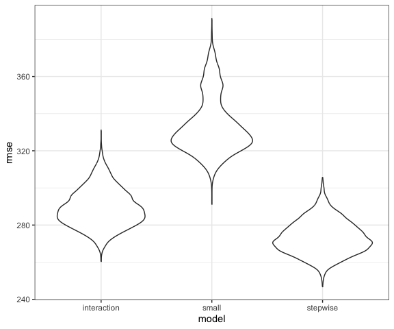

Homework 6
================
Derek Lamb
2023-11-24

### Load packages

``` r
# Load packages
library(tidyverse)
library(broom)
library(modelr)

# Set default figure options
knitr::opts_chunk$set(
  fig.width = 6,
  out.width = "90%"
)

theme_set(theme_bw() + theme(legend.position = "bottom"))

options(
  ggplot2.continuous.colour = "viridis",
  ggplot2.continuous.fill = "viridis"
)

scale_colour_discrete = scale_colour_viridis_d
scale_fill_discrete = scale_fill_viridis_d
```

# Problem 1

I imported the data using similar code to that which I wrote in HW5, but
with a few additional cleaning steps for this problem. The final data
set considers only 5 variables: the city & state of the homicide,
whether the case was solved, and victim demographics (age, race, sex).

``` r
df_homicide <- read_csv("data/homicide-data.csv", 
                        na = "Unknown") |> 
  mutate(
    state = str_to_upper(state),
    city_state = str_c(city, ", ", state),
    solved = case_when(
      disposition == "Closed by arrest" ~ 1,
      disposition != "Closed by arrest" ~ 0
    )
    ) |> 
  filter(!city_state %in% c("Tulsa, AL", "Dallas, TX", "Phoenix, AZ", "Kansas City, MO"),
         victim_race %in% c("Black", "White")) |> 
  select(city_state, victim_age, victim_sex, victim_race, solved)
```

Now I will fit a logistic regression model to predict the odds of cases
being solved by victim demographics.

``` r
bmore_model = 
  df_homicide |> 
  filter(city_state == "Baltimore, MD") |> 
  glm(solved ~ victim_age + victim_race + victim_sex,
      family = binomial,
      data = _)
```

This model is stored within R. I will use `tidy()` from the `broom`
package to examine it further. Calculating the adjusted odds ratios and
confidence intervals in a tidy format was challenging, so I created the
function below to add the values of interest to an input dataframe.

``` r
or_ci = function(df){
  df = 
    df |> 
    mutate(
      ci_lower = exp(estimate - 1.96*std.error),
      or = exp(estimate),
      ci_upper = exp(estimate + 1.96*std.error)
    )
  
  return(df)
}
```

Now I will apply the `or_ci` function to the logistic regression model
for Baltimore, MD.

``` r
bmore_or_sex = 
  bmore_model |> 
  tidy() |> 
  or_ci() |> 
  filter(term == "victim_sexMale") |> 
  select(ci_lower:ci_upper)
```

The adjusted odds ratio for sex on homicide is 0.43 (95% CI: 0.32,
0.56), this means that when the homicide victim is male in Baltimore,
MD, the case is 57% less likely to be solved than when the victim is
female, holding other demographic variables constant.

To apply this approach to the entire `df_homicide` dataframe, I will
create a second function to do the processing steps outlined in the
previous code chunk.

``` r
clean_or = function(df){
  df = 
    df |> 
    tidy() |> 
    or_ci() |> 
    filter(term == "victim_sexMale") |> 
    select(ci_lower:ci_upper)
  
  return(df)
}
```

To check that this still works, I will again apply it to the Baltimore
model.

``` r
bmore_model |> 
  clean_or()
```

    ## # A tibble: 1 × 3
    ##   ci_lower    or ci_upper
    ##      <dbl> <dbl>    <dbl>
    ## 1    0.325 0.426    0.558

It still works. Now I will do this for the entire dataset, using `map`
functions.

``` r
df_or_homicide = 
  df_homicide |> 
  group_by(city_state) |> 
  nest() |> 
  mutate(
    models = map(data, \(df) glm(solved ~ victim_age + victim_race + victim_sex,
                                family = binomial,
                                data = df)),
    odds_ratio = map(models, clean_or)
  ) |> 
  unnest(odds_ratio) |> 
  select(city_state, ci_lower:ci_upper) |> 
  ungroup()
```

``` r
df_or_homicide |> 
  mutate(city_state = fct_reorder(city_state, or)) |> 
  ggplot(aes(x = or, y = city_state)) + 
  geom_point() + 
  geom_errorbarh(aes(xmin = ci_lower, xmax = ci_upper)) + 
  labs(
      title = "Adjusted Odds Ratios for Sex on Homicide Closure",
      x = " Adjusted Odds Ratio",
      y = "City & State"
  )
```


In most cities, the point estimate for the adjusted odds ratio is below
1, suggesting that homicide cases with male victims are less likely to
be solved than those with female victims, holding other variables
constant. In some cities, such as New York City and Baton Rouge, the
odds ratio looks to be much lower than 0.5. There are three cities with
ORs appreciably above 1, suggesting that homicide cases with male
victims are more likely to be solved than female victims, holding other
variables constant. These three cities have wide CIs that cross 1,
however. Indeed, over half of these CIs cross 1, bringing the
relationship between victim sex and homicide closure into question
generally, though it is clear in some cities.

# Problem 2

I will pull in the data from the Central Park weather station.

``` r
df_weather = 
  rnoaa::meteo_pull_monitors(
    c("USW00094728"),
    var = c("PRCP", "TMIN", "TMAX"), 
    date_min = "2022-01-01",
    date_max = "2022-12-31") |>
  mutate(
    name = recode(id, USW00094728 = "CentralPark_NY"),
    tmin = tmin / 10,
    tmax = tmax / 10) |>
  select(name, id, everything())
```

    ## using cached file: /Users/Derek/Library/Caches/org.R-project.R/R/rnoaa/noaa_ghcnd/USW00094728.dly

    ## date created (size, mb): 2023-09-28 10:20:09.047204 (8.524)

    ## file min/max dates: 1869-01-01 / 2023-09-30

Here is a bootstrapping function that I think will be useful.

``` r
boot_samp = function(df){
  sample_frac(df, replace = TRUE)
}
```

This is what I want to happen, just 5000 times.

``` r
df_weather |> 
  boot_samp() |> 
  lm(tmax ~ tmin + prcp, data =_) |> 
  tidy()
```

    ## # A tibble: 3 × 5
    ##   term        estimate std.error statistic   p.value
    ##   <chr>          <dbl>     <dbl>     <dbl>     <dbl>
    ## 1 (Intercept)  7.91      0.252       31.4  1.64e-105
    ## 2 tmin         1.01      0.0183      55.3  1.49e-178
    ## 3 prcp         0.00500   0.00211      2.37 1.81e-  2

I created the dataframe I needed with 5000 samples of the weather
dataframe.

``` r
df_bootstrap = 
  tibble(n_strap = 1:5000) |> 
  mutate(
    samp = map(n_strap, \(i) boot_samp(df_weather))
  )
```

I then applied a linear model to each sample, and then used both the
`tidy` and `glance` functions from `broom` on the model. Both of these
functions output a `p.value` column within their dataframes, so I needed
to unnest and extract data one at a time.

Some of the values of $\hat{\beta_1}*\hat{\beta_2}$ were negative, and
therefore the logarithm of these values is not real. I therefore decided
to apply the absolute value function to these values in order to
visualize them.

``` r
df_bootstrap =
  df_bootstrap |> 
  mutate(model = map(samp, \(df) lm(tmax ~ tmin + prcp, data = df)),
         model_glance = map(model, glance),
         model_tidy = map(model, tidy)) |> 
  unnest(model_glance) |> 
  select(n_strap, r.squared, model_tidy) |> 
  unnest(model_tidy) |> 
  select(n_strap, r.squared, term, estimate) |> 
  filter(term != "(Intercept)") |> 
  pivot_wider(
    names_from = term,
    values_from = estimate) |> 
  mutate(log_beta = log(abs(tmin*prcp))) |> 
  select(r.squared,log_beta)
```

I will now construct histograms for these two estimated parameters.

``` r
df_bootstrap |> 
  ggplot(aes(x = r.squared)) +
  geom_histogram() + 
  labs(
    title = "Distribution of Bootstrap R-squared",
    x = "R-squared",
    y = "Frequency"
  )
```

    ## `stat_bin()` using `bins = 30`. Pick better value with `binwidth`.


``` r
df_bootstrap |> 
  ggplot(aes(x = log_beta)) +
  geom_histogram() + 
  labs(
    title = "Distribution of Bootstrap Log Beta Product",
    x = "Log(beta1 * beta2)",
    y = "Frequency"
  ) 
```

    ## `stat_bin()` using `bins = 30`. Pick better value with `binwidth`.


The distribution of $R^2$ looks close to normal, with a mean around
0.92. The distribution of $log(|\hat{\beta_1}*\hat{\beta_2}|)$ is
heavily left skewed, with a mode around -5. I will use quantiles to
obtain confidence intervals of these estimates.

``` r
df_bootstrap |> 
  pivot_longer(
    r.squared:log_beta,
    names_to = "parameter",
    values_to = "estimate"
  ) |> 
  group_by(parameter) |> 
  summarize(
    ci_lower = quantile(estimate, 0.025),
    ci_upper = quantile(estimate, 0.975)
  ) |> 
  knitr::kable(col.names = c("Parameter","CI Lower Bound", "CI Upper Bound"),
               digits = 3)
```

| Parameter | CI Lower Bound | CI Upper Bound |
|:----------|---------------:|---------------:|
| log_beta  |         -8.453 |         -4.599 |
| r.squared |          0.890 |          0.940 |

# Problem 3

``` r
df_bwt = 
  read_csv("data/birthweight.csv") |> 
  mutate(
    babysex = case_match(
      babysex,
      1 ~ "male",
      2 ~ "female"),
    malform = case_match(
      malform,
      0 ~ "absent",
      1 ~ "present"
    ),
    mrace = case_match(
      mrace,
      1 ~ "White",
      2 ~ "Black",
      3 ~ "Asian",
      4 ~ "Puerto Rican",
      8 ~ "Other"
    ),
    frace = case_match(
      frace,
      1 ~ "White",
      2 ~ "Black",
      3 ~ "Asian",
      4 ~ "Puerto Rican",
      8 ~ "Other",
      9 ~ "Unknown"
    ),
    babysex = as.factor(babysex),
    malform = as.factor(malform),
    mrace = as.factor(mrace),
    frace = as.factor(frace))
```

I will build this model using a stepwise regression approach, using AIC
to evaluate model performance. This can be performed using the
`stepAIC()` function in the `MASS` package.

``` r
base_model = 
  df_bwt |> 
  lm(bwt ~ ., data = _)

bwt_model = 
  base_model |> 
  MASS::stepAIC(direction = "both")
```

    ## Start:  AIC=48717.83
    ## bwt ~ babysex + bhead + blength + delwt + fincome + frace + gaweeks + 
    ##     malform + menarche + mheight + momage + mrace + parity + 
    ##     pnumlbw + pnumsga + ppbmi + ppwt + smoken + wtgain
    ## 
    ## 
    ## Step:  AIC=48717.83
    ## bwt ~ babysex + bhead + blength + delwt + fincome + frace + gaweeks + 
    ##     malform + menarche + mheight + momage + mrace + parity + 
    ##     pnumlbw + pnumsga + ppbmi + ppwt + smoken
    ## 
    ## 
    ## Step:  AIC=48717.83
    ## bwt ~ babysex + bhead + blength + delwt + fincome + frace + gaweeks + 
    ##     malform + menarche + mheight + momage + mrace + parity + 
    ##     pnumlbw + ppbmi + ppwt + smoken
    ## 
    ## 
    ## Step:  AIC=48717.83
    ## bwt ~ babysex + bhead + blength + delwt + fincome + frace + gaweeks + 
    ##     malform + menarche + mheight + momage + mrace + parity + 
    ##     ppbmi + ppwt + smoken
    ## 
    ##            Df Sum of Sq       RSS   AIC
    ## - frace     4    124365 320848704 48712
    ## - malform   1      1419 320725757 48716
    ## - ppbmi     1      6346 320730684 48716
    ## - momage    1     28661 320752999 48716
    ## - mheight   1     66886 320791224 48717
    ## - menarche  1    111679 320836018 48717
    ## - ppwt      1    131132 320855470 48718
    ## <none>                  320724338 48718
    ## - fincome   1    193454 320917792 48718
    ## - parity    1    413584 321137922 48721
    ## - mrace     3    868321 321592659 48724
    ## - babysex   1    853796 321578134 48727
    ## - gaweeks   1   4611823 325336161 48778
    ## - smoken    1   5076393 325800732 48784
    ## - delwt     1   8008891 328733230 48823
    ## - blength   1 102050296 422774634 49915
    ## - bhead     1 106535716 427260054 49961
    ## 
    ## Step:  AIC=48711.51
    ## bwt ~ babysex + bhead + blength + delwt + fincome + gaweeks + 
    ##     malform + menarche + mheight + momage + mrace + parity + 
    ##     ppbmi + ppwt + smoken
    ## 
    ##            Df Sum of Sq       RSS   AIC
    ## - malform   1      1447 320850151 48710
    ## - ppbmi     1      6975 320855679 48710
    ## - momage    1     28379 320877083 48710
    ## - mheight   1     69502 320918206 48710
    ## - menarche  1    115708 320964411 48711
    ## - ppwt      1    133961 320982665 48711
    ## <none>                  320848704 48712
    ## - fincome   1    194405 321043108 48712
    ## - parity    1    414687 321263390 48715
    ## + frace     4    124365 320724338 48718
    ## - babysex   1    852133 321700837 48721
    ## - gaweeks   1   4625208 325473911 48772
    ## - smoken    1   5036389 325885093 48777
    ## - delwt     1   8013099 328861802 48817
    ## - mrace     3  13540415 334389119 48885
    ## - blength   1 101995688 422844392 49908
    ## - bhead     1 106662962 427511666 49956
    ## 
    ## Step:  AIC=48709.53
    ## bwt ~ babysex + bhead + blength + delwt + fincome + gaweeks + 
    ##     menarche + mheight + momage + mrace + parity + ppbmi + ppwt + 
    ##     smoken
    ## 
    ##            Df Sum of Sq       RSS   AIC
    ## - ppbmi     1      6928 320857079 48708
    ## - momage    1     28660 320878811 48708
    ## - mheight   1     69320 320919470 48708
    ## - menarche  1    116027 320966177 48709
    ## - ppwt      1    133894 320984044 48709
    ## <none>                  320850151 48710
    ## - fincome   1    193784 321043934 48710
    ## + malform   1      1447 320848704 48712
    ## - parity    1    414482 321264633 48713
    ## + frace     4    124393 320725757 48716
    ## - babysex   1    851279 321701430 48719
    ## - gaweeks   1   4624003 325474154 48770
    ## - smoken    1   5035195 325885346 48775
    ## - delwt     1   8029079 328879230 48815
    ## - mrace     3  13553320 334403471 48883
    ## - blength   1 102009225 422859375 49906
    ## - bhead     1 106675331 427525481 49954
    ## 
    ## Step:  AIC=48707.63
    ## bwt ~ babysex + bhead + blength + delwt + fincome + gaweeks + 
    ##     menarche + mheight + momage + mrace + parity + ppwt + smoken
    ## 
    ##            Df Sum of Sq       RSS   AIC
    ## - momage    1     29211 320886290 48706
    ## - menarche  1    117635 320974714 48707
    ## <none>                  320857079 48708
    ## - fincome   1    195199 321052278 48708
    ## + ppbmi     1      6928 320850151 48710
    ## + malform   1      1400 320855679 48710
    ## - parity    1    412984 321270064 48711
    ## + frace     4    125020 320732060 48714
    ## - babysex   1    850020 321707099 48717
    ## - mheight   1   1078673 321935752 48720
    ## - ppwt      1   2934023 323791103 48745
    ## - gaweeks   1   4621504 325478583 48768
    ## - smoken    1   5039368 325896447 48773
    ## - delwt     1   8024939 328882018 48813
    ## - mrace     3  13551444 334408523 48881
    ## - blength   1 102018559 422875638 49904
    ## - bhead     1 106821342 427678421 49953
    ## 
    ## Step:  AIC=48706.02
    ## bwt ~ babysex + bhead + blength + delwt + fincome + gaweeks + 
    ##     menarche + mheight + mrace + parity + ppwt + smoken
    ## 
    ##            Df Sum of Sq       RSS   AIC
    ## - menarche  1    100121 320986412 48705
    ## <none>                  320886290 48706
    ## - fincome   1    240800 321127090 48707
    ## + momage    1     29211 320857079 48708
    ## + ppbmi     1      7479 320878811 48708
    ## + malform   1      1678 320884612 48708
    ## - parity    1    431433 321317724 48710
    ## + frace     4    124743 320761547 48712
    ## - babysex   1    841278 321727568 48715
    ## - mheight   1   1076739 321963029 48719
    ## - ppwt      1   2913653 323799943 48743
    ## - gaweeks   1   4676469 325562760 48767
    ## - smoken    1   5045104 325931394 48772
    ## - delwt     1   8000672 328886962 48811
    ## - mrace     3  14667730 335554021 48894
    ## - blength   1 101990556 422876847 49902
    ## - bhead     1 106864308 427750598 49952
    ## 
    ## Step:  AIC=48705.38
    ## bwt ~ babysex + bhead + blength + delwt + fincome + gaweeks + 
    ##     mheight + mrace + parity + ppwt + smoken
    ## 
    ##            Df Sum of Sq       RSS   AIC
    ## <none>                  320986412 48705
    ## + menarche  1    100121 320886290 48706
    ## - fincome   1    245637 321232048 48707
    ## + momage    1     11698 320974714 48707
    ## + ppbmi     1      8823 320977589 48707
    ## + malform   1      1884 320984528 48707
    ## - parity    1    422770 321409181 48709
    ## + frace     4    128726 320857686 48712
    ## - babysex   1    846134 321832545 48715
    ## - mheight   1   1012240 321998651 48717
    ## - ppwt      1   2907049 323893461 48743
    ## - gaweeks   1   4662501 325648912 48766
    ## - smoken    1   5073849 326060260 48771
    ## - delwt     1   8137459 329123871 48812
    ## - mrace     3  14683609 335670021 48894
    ## - blength   1 102191779 423178191 49903
    ## - bhead     1 106779754 427766166 49950

``` r
bwt_model |> 
  anova()
```

    ## Analysis of Variance Table
    ## 
    ## Response: bwt
    ##             Df    Sum Sq   Mean Sq   F value    Pr(>F)    
    ## babysex      1   8547634   8547634  115.2515 < 2.2e-16 ***
    ## bhead        1 628838120 628838120 8478.8991 < 2.2e-16 ***
    ## blength      1 140213755 140213755 1890.5633 < 2.2e-16 ***
    ## delwt        1   8647158   8647158  116.5934 < 2.2e-16 ***
    ## fincome      1   4845845   4845845   65.3386 8.111e-16 ***
    ## gaweeks      1   5936110   5936110   80.0392 < 2.2e-16 ***
    ## mheight      1    883287    883287   11.9097 0.0005638 ***
    ## mrace        3  11463486   3821162   51.5224 < 2.2e-16 ***
    ## parity       1    481225    481225    6.4886 0.0108914 *  
    ## ppwt         1   2735314   2735314   36.8814 1.363e-09 ***
    ## smoken       1   5073849   5073849   68.4129 < 2.2e-16 ***
    ## Residuals 4328 320986412     74165                        
    ## ---
    ## Signif. codes:  0 '***' 0.001 '**' 0.01 '*' 0.05 '.' 0.1 ' ' 1

``` r
bwt_model |> 
  tidy() |> 
  knitr::kable()
```

| term              |      estimate |   std.error |   statistic |   p.value |
|:------------------|--------------:|------------:|------------:|----------:|
| (Intercept)       | -6145.1506698 | 141.9496468 | -43.2910599 | 0.0000000 |
| babysexmale       |   -28.5580171 |   8.4548958 |  -3.3776900 | 0.0007374 |
| bhead             |   130.7770408 |   3.4465672 |  37.9441440 | 0.0000000 |
| blength           |    74.9471109 |   2.0190479 |  37.1200270 | 0.0000000 |
| delwt             |     4.1067316 |   0.3920592 |  10.4747754 | 0.0000000 |
| fincome           |     0.3180229 |   0.1747477 |   1.8198980 | 0.0688436 |
| gaweeks           |    11.5924873 |   1.4620657 |   7.9288417 | 0.0000000 |
| mheight           |     6.5940377 |   1.7848817 |   3.6943835 | 0.0002231 |
| mraceBlack        |   -63.9057046 |  42.3662612 |  -1.5084103 | 0.1315225 |
| mracePuerto Rican |   -25.7913672 |  45.3501537 |  -0.5687162 | 0.5695783 |
| mraceWhite        |    74.8867755 |  42.3146313 |   1.7697608 | 0.0768374 |
| parity            |    96.3046933 |  40.3362158 |   2.3875490 | 0.0170038 |
| ppwt              |    -2.6755853 |   0.4273585 |  -6.2607517 | 0.0000000 |
| smoken            |    -4.8434197 |   0.5855757 |  -8.2712102 | 0.0000000 |

``` r
bwt_model |> 
  glance() |> 
  select(-c(sigma, logLik, BIC, deviance)) |> 
  knitr::kable()
```

| r.squared | adj.r.squared | statistic | p.value |  df |      AIC | df.residual | nobs |
|----------:|--------------:|----------:|--------:|----:|---------:|------------:|-----:|
| 0.7180997 |     0.7172529 |  848.0727 |       0 |  13 | 61029.44 |        4328 | 4342 |

I will look at a plot of residuals vs predicted values to assess model
performance.

``` r
df_bwt |> 
  add_residuals(bwt_model) |> 
  add_predictions(bwt_model) |> 
  ggplot(aes(x = pred, y = resid)) + 
  geom_point() + 
  geom_smooth(method = "lm", formula = y ~ x) + 
  labs(
    x = "Predicted Birthweight",
    y = "Residuals"
  )
```


There are a few cases with the model underpredicting badly, particularly
with children who have a low birthweight. This might be indicative of
the model only performing well on the more ‘typical’ baby, which
represents the majority of the data it was trained on. However, in
general the residuals appear to not change much with predicted
birthweight and be centered around zero, based upon the smoothing line.

To test the model generated by the stepwise selection approach against
two pre-defined models, I will use cross validation.

``` r
df_cv = 
  df_bwt |>
  crossv_mc(5000) |> 
  mutate(
    train = map(train, as_tibble),
    test = map(test, as_tibble),
    stepwise_model = map(train, \(df) lm(
      bwt ~ babysex + bhead + blength + delwt + fincome + gaweeks + 
        mheight + mrace + parity + ppwt + smoken, data = df)),
    small_model = map(train, \(df) lm(bwt ~ blength + gaweeks, data = df)),
    interaction_model = map(train, \(df) lm(
      bwt ~ bhead + blength + babysex + bhead*blength + bhead*babysex + 
        blength*babysex + bhead*blength*babysex, data = df))
  ) |> 
  mutate(
    rmse_stepwise = map2_dbl(stepwise_model, test, 
                             \(mod, df) rmse(model = mod, data = df)),
    rmse_small = map2_dbl(small_model, test, 
                          \(mod, df) rmse(model = mod, data = df)),
    rmse_interaction = map2_dbl(interaction_model, test,
                                \(mod, df) rmse(model = mod, data = df))
  )
```

    ## Warning: There were 38 warnings in `mutate()`.
    ## The first warning was:
    ## ℹ In argument: `rmse_stepwise = map2_dbl(...)`.
    ## Caused by warning in `predict.lm()`:
    ## ! prediction from rank-deficient fit; attr(*, "non-estim") has doubtful cases
    ## ℹ Run `dplyr::last_dplyr_warnings()` to see the 37 remaining warnings.

``` r
## There are warnings here for some reason?
```

Now I will plot the RMSEs from these models to compare their performance

``` r
df_cv |> 
  select(starts_with("rmse")) |> 
  pivot_longer(
    everything(),
    names_to = "model",
    values_to = "rmse",
    names_prefix = "rmse_"
  ) |> 
  ggplot(aes(x = model, y = rmse)) +
  geom_violin()
```


